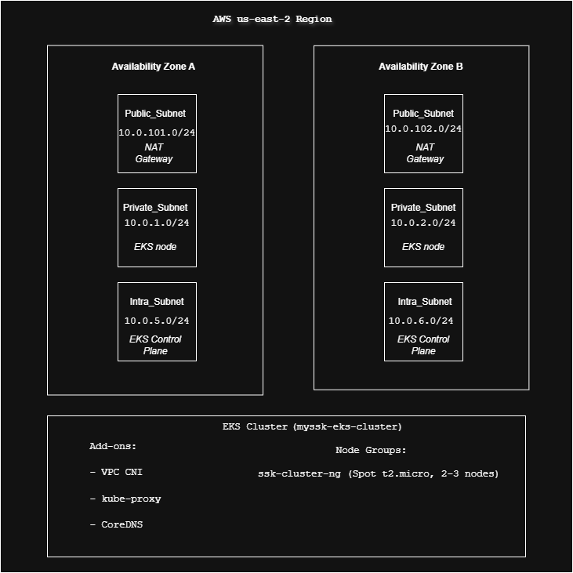

# ☁️ AWS EKS Cluster Infrastructure


This repository contains Infrastructure as Code (IaC) to deploy a production-grade **Amazon EKS cluster** using **Terraform**, with local state and automated CI/CD using **GitLab pipelines**.

---

## 🚀 Features

- 🛠 **Managed Kubernetes (EKS)** using Terraform
- 🌐 **Custom VPC** with public, private, and intra subnets across two AZs
- 💸 **Cost-effective setup** using EC2 Spot Instances for worker nodes
- 🔐 **Secure architecture** with private node groups and limited internet exposure
- 🔄 **CI/CD automation** via GitLab with `.gitlab-ci.yml`
- 🖥️ **Local deploy script** using `deploy.sh` for on-demand provisioning

---
## Architecture



## Usage

### Prerequisites
- Terraform 1.0+
- AWS CLI configured
- kubectl
- AWS IAM permissions for EKS

### Deployment

```bash
# Initialize Terraform
terraform init

# Review changes
terraform plan

# Apply configuration
terraform apply
